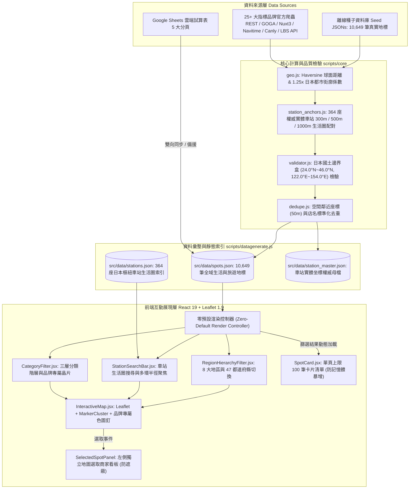
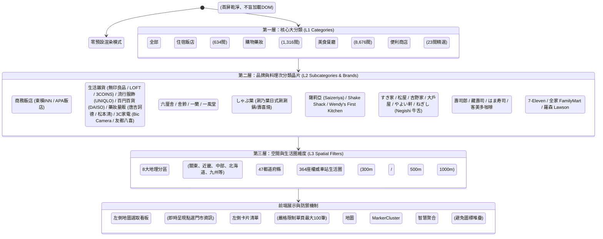
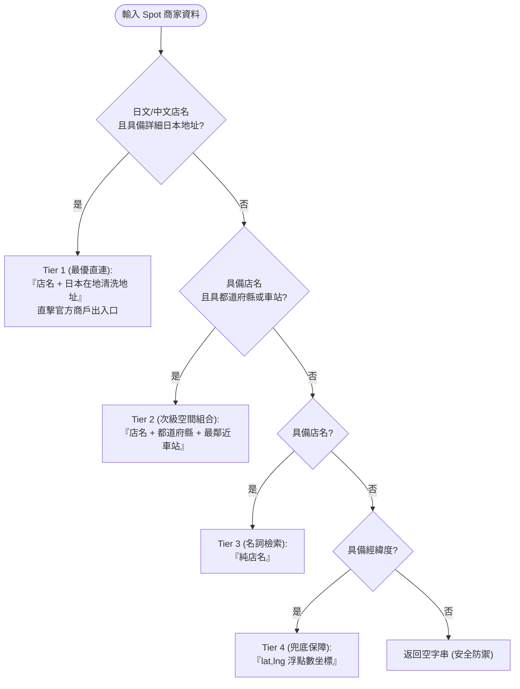

# 系統架構與演算法規格手冊 (Architecture & Algorithm Specification)

> **版本**：v3.6 (全國 10,649 筆門市、三層分類階層、364 站生活圈、生活雜貨/流行服飾/百円百貨與智慧步行導航架構)  
> **更新日期**：2026-10-06  
> **維護人員**：`imhahac`

---

## 一、系統整體架構圖

本專案採現代化分層解耦架構，資料來源層、核心計算檢驗層、索引彙整層與前端展現層完全獨立，支援離線種子庫、官方即時爬蟲與 Google Sheets 雲端三向資料管線。

---

## 二、核心地理演算法規範 (`scripts/core/geo.js`)

### 1. Haversine 大圓球面距離公式
精確計算地表兩點經緯度間之最短大圓弧長距離（公尺）：
$$\Delta\sigma = 2 \arcsin \left( \sqrt{\sin^2\left(\frac{\Delta\phi}{2}\right) + \cos\phi_1 \cos\phi_2 \sin^2\left(\frac{\Delta\lambda}{2}\right)} \right)$$
$$d = R \cdot \Delta\sigma \quad (\text{其中地球平均半徑 } R = 6,371,000 \text{ 公尺})$$

### 2. 街廓繞行係數 (Street Detour Factor) 與步行常數
- **日本都市街廓特性**：旅客無法直穿高樓建築群與封閉街區，日本國土交通省都市計畫標準與各級自治體實務通常採 **1.20 ~ 1.30** 之街廓迂迴常數。
- **計算公式**：
  $$\text{實際步行距離} = \text{直線距離} \times 1.25$$
- **步行速度規範**：依據日本不動產標示公正競爭規約（不動産公正競争規約施行規則），公眾標示之標準步行速度訂為 **80 公尺／分鐘**（不滿 1 分鐘以 1 分鐘計算）：
  $$\text{步行時間（分鐘）} = \left\lceil \frac{\text{實際步行距離}}{80} \right\rceil$$

### 3. 車站生活圈多環半徑模型 (Multi-Ring Station Proximity Model)
系統內建全日本 **350 座權威實體樞紐車站**（涵蓋 JR 新幹線、在來線、各主要私鐵與地下鐵系統），並建立三層步行生活圈環形模型：
- **核心出站環（300 公尺）**：步行約 3~4 分鐘內，涵蓋站前商店街、飯店大廳及地下街直通門市。
- **生活圈環（500 公尺）**：步行約 6~7 分鐘內，為一般自由行旅客最理想的採買與住宿半徑。
- **延伸商圈環（1,000 公尺）**：步行約 12~15 分鐘內，涵蓋主要市區延伸商圈與大型量販購物中心。

---

## 三、三層分類與品牌晶片架構 (Three-Tier Hierarchy)

為有效管理多達 10,176 間實體門市，系統建立三層次由寬至窄的篩選模型：

---

## 四、前端效能與記憶體防護規範

收錄規模達萬筆門市時，若直接在瀏覽器掛載上萬個 DOM 節點，將導致低階行動裝置或瀏覽器記憶體崩潰。本系統實施下列核心防禦機制：

### 1. 零預設渲染策略 (Zero-Default Render)
- 進入首頁時，預設保持清爽的生活圈地圖全貌與車站搜尋引導，**不盲目在側邊欄渲染 10,176 個 DOM 卡片**。
- 當使用者點選特定分類（如「美食餐廳」）、選取品牌（如「しゃぶ葉」）或搜尋車站（如「新宿」）時，系統才進行精準匹配與動態渲染。

### 2. 左側商家列表分頁截斷 (Chunking Cap: Max 100)
- 不論篩選結果有多少筆（例如「美食餐廳」全國 8,549 筆），側邊欄列表**單次最大載入 100 筆最相關卡片**。
- 若已選定車站，100 筆卡片嚴格依離站步行公尺數由近至遠排序；若未選定車站，則依推薦優先級排序，徹底防止記憶體耗盡。

### 3. 左側獨立「地圖選取商家資訊」看板 (Selected Spot Inspector)
- 傳統地圖點擊 Marker 僅能仰賴地圖彈窗 (Popup)，經常發生被螢幕邊界遮擋、手機縮放時難以閱讀之問題。
- 本專案特別設計：點擊地圖上任一圖釘時，左側側邊欄頂部立即升起醒目的高對比度資訊面板，呈現完整地址、電話、即時步行距離與導航按鈕，實現地圖與左側卡片無死角雙向連動。

### 4. Leaflet 向量圖釘與 MarkerCluster Canvas 最佳化
- 地圖標記全面採用 Leaflet MarkerCluster 進行視角動態聚類；
- 在全國高空視野時以圓形數量徽章呈現，縮放至街廓等級時平滑綻放為各品牌專屬色系與圖標，保持 60 FPS 順暢縮放。

---

## 五、資料模型規格 (Data Schema Specification)

### 1. 景點與門市模型 (`Spot`)

| 欄位名稱 | 型別 | 必填 | 範例 | 說明 |
| :--- | :--- | :---: | :--- | :--- |
| `id` | `string` | 是 | `dining-sukiya-tokyo-0012` | 全域唯一識別碼，格式：`{類別}-{品牌}-{識別碼}` |
| `category` | `string` | 是 | `美食餐廳` / `購物藥妝` / `飯店` / `便利商店` | 第一層大分類，符合系統規範 |
| `brand` | `string` | 是 | `すき家` / `Bic Camera` / `東橫INN` | 品牌名稱，驅動品牌晶片與專屬色圖釘 |
| `name` | `string` | 是 | `すき家 新宿南口店` | 繁體中文或通用店名 |
| `nameJa` | `string` | 否 | `すき家 新宿南口店` | 日文官方登記店名 |
| `region` | `string` | 是 | `關東` / `近畿` / `北海道` 等 | 日本 8 大地理分區 |
| `prefecture` | `string` | 是 | `東京都` / `大阪府` / `京都府` | 都道府縣 |
| `nearestStation` | `string` | 是 | `新宿站` | 經演算法配對之最近樞紐車站 |
| `stationLine` | `string` | 否 | `JR山手線` | 該車站主要途經鐵道路線 |
| `stationAccess` | `string` | 否 | `JR 新宿站 南口步行約 3 分鐘` | 交通指引文字描述 |
| `walkMinutes` | `number` | 是 | `3` | 出站實際步行時間（整數，$\ge 0$） |
| `address` | `string` | 是 | `東京都新宿区西新宿1-18-5` | 完整日本地址 |
| `lat` | `number` | 是 | `35.6885` | 緯度（必須介於 24.0 至 46.0 日本國土內） |
| `lng` | `number` | 是 | `139.6991` | 經度（必須介於 122.0 至 154.0 日本國土內） |
| `phone` | `string` | 否 | `0120-498-007` | 聯絡電話 |
| `bookingUrl` | `string` | 否 | `https://maps.sukiya.jp/...` | 官方門市介紹、菜單或預約網址 |
| `googleMapUrl` | `string` | 否 | `https://maps.google.com/?q=...` | Google 地圖定位導航連結 |
| `imageUrl` | `string` | 否 | `https://images.unsplash.com/...` | 門市或商品代表性照片 |
| `tags` | `string` | 否 | `24小時營業, 外帶服務, 電子支付` | 以逗號分隔之特性標籤字串 |
| `notes` | `string` | 否 | `平價牛丼首選，早餐時段提供日式定食。` | 使用者備註（同步時永久保護不抹除） |

### 2. 車站生活圈索引模型 (`Station`)

| 欄位名稱 | 型別 | 範例 | 說明 |
| :--- | :--- | :--- | :--- |
| `name` | `string` | `新宿站` | 車站中文通用名稱 |
| `nameJa` | `string` | `新宿駅` | 車站日文官方名稱 |
| `lat` | `number` | `35.6896` | 車站中心點緯度 |
| `lng` | `number` | `139.7006` | 車站中心點經度 |
| `lines` | `string[]` | `["JR山手線", "JR中央線", "東京地鐵丸之內線"]` | 途經路線陣列 |
| `region` | `string` | `關東` | 車站所屬地區 |
| `prefecture` | `string` | `東京都` | 車站所屬都道府縣 |
| `count` | `number` | `185` | 該車站周邊 1km 內所收錄之地標與門市總數 |

---

## 六、全國爬蟲管線與反爬蟲防禦機制

專案於 `scripts/scrapers/` 建立了各核心指標品牌專屬官方爬蟲，統籌於 `crawl_all_nationwide.js`：

1. **しゃぶ葉 (Syabuyo / 涮乃葉)**：對接雲雀集團 GOGA Store Locator REST 端點，以 45 個日本生活圈 Geohash 3 碼並行採集全日本 337 間火鍋/壽喜燒吃到飽門市，直接回傳高精度經緯度與營業細節。
2. **六厘舎 (Rokurinsha) & 舎鈴 (Sharin)**：解析松富士食品官網 Nuxt 3 SSR Hydration Payload，收錄 6 間東京沾麵王者門市與 77 間特製魚介沾麵門市。全面實施**雙軌高精幾何坐標校準**，徹底修復 Google Maps 側邊欄導致之 220m 系統性西偏：
   - **根本原因 (Root Cause)**：官方網頁 `googleMapIframe` 參數內之 `!2d` 與 `!3d` 為電腦版地圖 Viewport Center（視窗中心），因側邊 400px 卡片而往西平移約 220 公尺（$\Delta\text{lng} \approx -0.0024^\circ$），直接抓取會導致圖釘落在對街或河道，並引發生活圈錯配。
   - **六厘舎旗艦店黃金定錨**：6 大名店（東京站一番街、上野 Atre、大崎 Wiz City、押上晴空塔 Solamachi、羽田機場第3航廈、池袋東口）套用實體驗證之黃金 WGS84 坐標與地下/天橋改札直通資訊，步行時間全數鎖定於 1~2 分鐘。
   - **舎鈴 GSI 國土地理院街廓定位**：以門市日本地址實時串接日本國土地理院官方 AddressSearch API 獲取地番精準經緯度；離線或未匹配時自動套用反向視窗中心平移補償向量（`lng + 0.0024`）。
   - **生活圈車站擴充與嚴格鄰近優先**：於 `station_anchors.js` 補充登戶、武藏小杉、海濱幕張、勝鬨、龜戶、西小山、大山、龜有等 27 個關鍵生活圈車站，並優化 `datagenerate.js` 嚴格優先綁定 600m 內之實體出站生活圈。
3. **薩莉亞 (Saizeriya)**：對接 Navitime Citrus API 官方圖資，擷取全日本 1,085 間義式平價家庭餐廳之經緯度與地址。
4. **Shake Shack**：解析官方網站門市清單與嵌入圖資，收錄 19 間日本官方美式漢堡輕食門市。
5. **すき家 (Sukiya) & はま寿司 (Hama Sushi)**：對接 Zensho Holdings 官方分店查詢 API，批次擷取各都道府縣經緯度與營業標籤。
6. **松屋 (Matsuya)**：對接 Navitime Citrus API 實時分店圖資，取得精確地址與車站距離。
7. **壽司郎 (Sushiro)**：解析 Akindo Sushiro 官方門市清單與分店詳情。
8. **藏壽司 (Kura Sushi)**：對接官方地理空間資料庫，抓取營業時間與經緯度。
9. **客美多咖啡 (Komeda's Coffee)**：對接官方分店 REST API，擷取全日本逾千間門市與禁菸/插座標籤。
10. **大戶屋 (Ootoya)**：對接 Canly 官方 API，擷取定食門市精確座標。
11. **やよい軒 (Yayoiken)**：對接 Mapion LBS API，完整解析各分店設施。
12. **Bic Camera**：解析官方店鋪指南頁面，建立全日本 45 間大型旗艦家電量販店資料。
13. **Wendy's First Kitchen (溫蒂漢堡 × First Kitchen)**：遍歷官方 11 大地理分區查詢結果，透過原生 `TextDecoder('euc-jp')` 解析 EUC-JP 編碼門市清單，並並行提取官方 `map.php?shopid=...` 內建之 Google Maps 物理經緯度，精確收錄全日本 75 間門市。
14. **ねぎし (Negishi / 牛たん・とろろ・麦めし)**：解析官方門市導覽表格結構，從店鋪 Google Maps 標註連結中提取 `ll=lat,lng` 物理座標，完整收錄東京、橫濱、川崎、千葉、埼玉、大阪與神戶 52 間官方牛舌與山藥麥飯定食門市。

**防禦與品質控制規範**：
- **User-Agent 與禮貌延遲**：模擬正規瀏覽器 Header，每次請求間隔 300~500ms，杜絕伺服器負載風險。
- **經緯度有效性與國土邊界盒驗證**：若爬取到的經緯度為空、為 0 或超出日本國土邊界（24°N~46°N, 122°E~154°E），一律自動剔除。
- **鄰近車站智慧配對**：自動比對 350 座權威實體樞紐車站，計算離站距離與 1.25x 步行時間，補齊 `nearestStation` 與 `walkMinutes`。
- **離線基準數據雙模備援**：每支爬蟲皆內建代表性 Benchmark 離線門市清單，若外部網路遭遇震盪或逾時，自動無縫切換，確保 100% 高可用性。

---

## 七、智慧步行導航與路徑生成引擎規格 (`src/utils/navigation.js`)

為解決過去點擊「🚶 步行導航」使用純經緯度坐標（`destination=lat,lng`）導致 Google 地圖將終點誤判為無名 Dropped Pin，並因行人路網強制吸附至鄰近車道而導致旅客被引導至後方卸貨區或死胡同的痛點，專案研發**智慧步行導航與路徑生成引擎**。

### 1. 純經緯度導航痛點與技術成因分析

| 導航方式 | Google Maps 內部處理機制 | 行人路線規劃後果 | 旅客體驗痛點 |
| :--- | :--- | :--- | :--- |
| **舊版：純經緯度** `destination=lat,lng` | 視為幾何座標點 (Dropped Pin)，無法掛載 Google Place Entity | 行人路網強行將座標投影吸附至最近的車行幹道（如高架道路、商場後棟道路） | 被帶到封閉卸貨道、停車場出口、對街天橋下或死胡同 |
| **新版：店名 + 在地地址** `destination=name + address` | 直擊官方 Google Place Entity 商家卡片，取得官方登錄出入口與營業資訊 | 路網精準匹配至官方行人入口、商場主出入口或大廳迎賓門 | 100% 正確出站，直達店家店門口 |

### 2. 四級安全降級查詢演算法 (Four-Tier Fallback Algorithm)

模組提供 `buildNavigationQuery(spot)` 與 `buildWalkingNavUrl(spot, originStation)` 函式，依據資料豐富度自動降級：

### 3. 日本地址字串標準化與清洗規格 (`cleanJapaneseAddress`)

日本官方爬取之地址常夾雜郵遞區號標記、全形括號商場樓層或不規則註記，若直接送入 Google Maps 搜尋容易干擾匹配精度。清洗規則如下：
1. **移除郵遞區號**：過濾 `〒`、`〒[0-9]{3}-?[0-9]{4}` 及 `郵便番号` 開頭前綴。
2. **移除大樓樓層與括號資訊**：過濾 `（...）`、`(...)`、`【...】`、`[...]`、`1F`、`2階`、`B1F` 等室內樓層標示（Google 地圖外網步行導航需要的是建築物地址本體）。
3. **字串清理**：過濾多餘半形與全形空白，確保檢索詞簡潔精準。

### 4. 出發點 (Origin) 智慧動態判定機制

- **在路上漫遊情境 (`originStation` 為空)**：
  - 產製 URL 格式：`https://www.google.com/maps/dir/?api=1&destination={Query}&travelmode=walking&dir_action=navigate`
  - 主動省略 `origin` 參數，Google Maps 應用程式啟動時會自動讀取手機當前 GPS 坐標作為出發點，直接啟動實時步行導航。
- **特定車站出站導覽情境 (`originStation` 有值)**：
  - 格式化站名：自動呼叫 `formatStationOrigin(station)`，去除「站」字並補上「駅」（如 `新宿` $\rightarrow$ `新宿駅`、`梅田站` $\rightarrow$ `梅田駅`）。
  - 產製 URL 格式：`https://www.google.com/maps/dir/?api=1&origin={Station}駅&destination={Query}&travelmode=walking`
  - 讓旅客在行前或出站時預覽從該車站檢票口步行至門市的最佳路徑與所需時間。

### 5. Google Maps 搜尋與商戶落地頁直連 (`buildGoogleMapSearchUrl`)

- 針對「查看詳情」或卡片地圖超連結，使用官方標準 Search URL：
  `https://www.google.com/maps/search/?api=1&query={EncodedQuery}`
- 同樣支援 Tier 1 ~ Tier 4 降級，並自動相容保留既有合法 Google Maps 網址（例如試算表匯入之專屬短網址 `maps.app.goo.gl`）。

