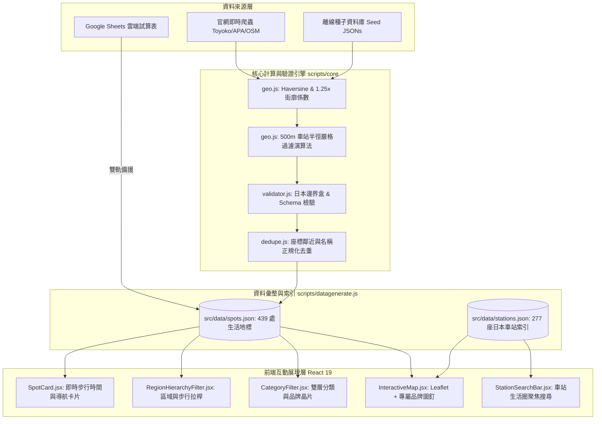

# 系統架構與演算法設計手冊 (Architecture & Algorithm Specification)

> **版本**：v2.0 (多類別、雙層篩選與生活圈導引架構)  
> **更新日期**：2026-10-02

---

## 一、系統整體架構圖

本專案採分層解耦架構，資料層、演算法層與前端展現層完全獨立，支援離線 Seed、即時爬蟲與 Google Sheets 雲端三向資料管線。



---

## 二、核心地理演算法規範 (`scripts/core/geo.js`)

### 1. Haversine 大圓距離公式
計算兩點經緯度之球面最短距離（公尺）：
$$\Delta\sigma = 2 \arcsin \left( \sqrt{\sin^2\left(\frac{\Delta\phi}{2}\right) + \cos\phi_1 \cos\phi_2 \sin^2\left(\frac{\Delta\lambda}{2}\right)} \right)$$
$$d = R \cdot \Delta\sigma \quad (\text{其中 } R = 6,371,000 \text{ 公尺})$$

### 2. 街廓繞行係數 (Street Detour Factor) 與步行常數
- **日本都市街廓特性**：旅客無法直穿高樓建築物，日本國土交通省都市計畫基準實務通常採 **1.20 ~ 1.30** 之迂迴常數。
- **計算公式**：
  $$\text{實際步行距離} = \text{直線距離} \times 1.25$$
- **步行速度**：依據日本不動產標示公正競爭規約（不動産公正競争規約），標準步行速度訂為 **80 公尺／分鐘**（不滿 1 分鐘以 1 分鐘計）：
  $$\text{步行分鐘} = \left\lceil \frac{\text{實際步行距離}}{80} \right\rceil$$

### 3. 車站 500 公尺半徑過濾演算法 (`filterStoresWithinStationRadius`)
- **設計動機**：日本三大超商與平價牛丼總店數超過數萬間，若無限制收錄將造成：
  1. 瀏覽器 Leaflet MarkerCluster 記憶體暴增、行動裝置卡頓；
  2. Google Sheet 存取超過 6 分鐘逾時；
  3. 旅客查找失去「出站生活圈」的聚焦性。
- **演算法邏輯**：
  1. 對每筆待檢驗門市，計算其與全日本 277 座主要樞紐車站的直線距離；
  2. 僅保留 $\text{最近車站距離} \le 500\text{m}$ 之門市；
  3. 距離大於 500m 的郊區門市一律自動排除，確保每處地標皆在出站步行可及範圍（6 分鐘以內）。

---

## 三、資料模型規範 (Schema Specification)

### 1. 景點與門市模型 (`Spot`)

| 欄位名稱 | 型別 | 必填 | 範例 | 說明 |
| :--- | :--- | :---: | :--- | :--- |
| `id` | `string` | 是 | `dining-yoshinoya-shinjuku-east` | 全域唯一識別碼，格式：`{類別}-{品牌代碼}-{分店}` |
| `category` | `string` | 是 | `飯店` / `購物藥妝` / `美食餐廳` / `便利商店` | 頂層大分類，必須符合系統枚舉值 |
| `brand` | `string` | 是 | `東橫INN` / `吉野家` / `7-Eleven` | 品牌名稱，驅動第二層晶片與專屬圖釘 |
| `name` | `string` | 是 | `7-Eleven 新宿東口站前店` | 繁體中文或習慣稱呼之完整店名 |
| `nameJa` | `string` | 否 | `セブン-イレブン 新宿東口駅前店` | 日文官方登記店名 |
| `region` | `string` | 是 | `關東` / `近畿` / `北海道` 等 | 日本八大地理分區 |
| `prefecture` | `string` | 是 | `東京都` / `大阪府` / `京都府` | 都道府縣 |
| `nearestStation` | `string` | 是 | `新宿站` | 經由演算法配對之最近車站 |
| `stationLine` | `string` | 否 | `JR山手線` | 該車站主要途經鐵道路線 |
| `stationAccess` | `string` | 否 | `JR 新宿站 東口步行約 2 分鐘` | 交通指引文字描述 |
| `walkMinutes` | `number` | 是 | `2` | 出站實際步行時間（整數，$\ge 0$） |
| `address` | `string` | 是 | `東京都新宿区新宿3-24-1` | 完整日本地址 |
| `lat` | `number` | 是 | `35.6918` | 緯度（必須介於 24.0 至 46.0） |
| `lng` | `number` | 是 | `139.7012` | 經度（必須介於 122.0 至 154.0） |
| `phone` | `string` | 否 | `03-3352-7111` | 連絡電話 |
| `bookingUrl` | `string` | 否 | `https://www.sej.co.jp/` | 官方預約或門市詳情連結 |
| `googleMapUrl` | `string` | 否 | `https://maps.google.com/?q=...` | Google 地圖定位連結 |
| `imageUrl` | `string` | 否 | `https://images.unsplash.com/...` | 門市或商品代表性照片 |
| `tags` | `string` | 否 | `24小時營業, Seven Bank ATM` | 以逗號分隔之特性標籤字串 |
| `notes` | `string` | 否 | `提供外幣提款 ATM 與熟食炸物。` | 特色說明與使用者備註 |

### 2. 車站索引模型 (`Station`)

| 欄位名稱 | 型別 | 範例 | 說明 |
| :--- | :--- | :--- | :--- |
| `name` | `string` | `東京站` | 車站中文通用名稱 |
| `nameJa` | `string` | `東京駅` | 車站日文名稱 |
| `lat` | `number` | `35.681236` | 車站中心點緯度 |
| `lng` | `number` | `139.767125` | 車站中心點經度 |
| `lines` | `string[]` | `["JR山手線", "JR中央線"]` | 途經路線陣列 |
| `region` | `string` | `關東` | 車站所屬地區 |
| `prefecture` | `string` | `東京都` | 車站所屬都道府縣 |
| `count` | `number` | `8` | 該車站周邊 500m~1km 內之地標數量 |

---

## 四、前端雙層篩選與狀態流轉

```mermaid
stateDiagram-v2
    [*] --> 全部顯示 (439處地標)

    state "第一層：大類切換" as L1 {
        全部 --> 飯店 (372)
        全部 --> 購物藥妝 (30)
        全部 --> 美食餐廳 (14)
        全部 --> 便利商店 (23)
    }

    state "第二層：品牌細分" as L2 {
        飯店 --> 東橫INN / APA飯店
        購物藥妝 --> 唐吉訶德 / 松本清
        美食餐廳 --> 吉野家 / 松屋 / すき家 / 一蘭 / 客美多
        便利商店 --> 7-Eleven / 全家 / 羅森
    }

    state "維度交集過濾" as Filters {
        區域都道府縣過濾
        步行拉桿 (3分/5分/10分)
        車站生活圈聚焦 (1km半徑)
    }

    L1 --> L2
    L2 --> Filters
    Filters --> 地圖圖釘即時重繪與聚合
```

---

## 五、目錄結構索引

```
japan-travel-map-guide/
├── .github/workflows/          # 自動化工作流程
│   ├── ci_test.yml             # [CI] 每次 PR / Push 執行測試與建置檢查
│   ├── deploy.yml              # [CD] 自動打包並部署至 GitHub Pages
│   ├── sync_to_sheet.yml       # [Sync] 雙向同步至 Google Sheet
│   └── crawl_url.yml           # [Scraper] 佇列爬蟲工作流
├── docs/                       # 零通靈完整文檔
│   ├── DEPLOYMENT.md           # 部署與維運手冊
│   ├── ARCHITECTURE.md         # 系統架構與演算法規格手冊
│   └── GOOGLE_SHEETS_GUIDE.md  # 試算表對齊與 GAS Webhook 指南
├── gas/
│   └── Code.gs                 # Google Apps Script Webhook 批次寫入引擎
├── scripts/
│   ├── core/                   # 核心不可變邏輯模組
│   │   ├── geo.js              # Haversine、路網係數與 500m 車站篩選
│   │   ├── validator.js        # 資料格式與日本邊界檢驗
│   │   └── dedupe.js           # 座標與名稱去重
│   ├── scrapers/               # 模組化爬蟲
│   │   ├── apa.js              # APA 飯店爬蟲
│   │   ├── donki.js            # 唐吉訶德爬蟲
│   │   ├── matsumoto.js        # 松本清爬蟲
│   │   ├── dining.js           # 平價美食連鎖爬蟲
│   │   └── convenience.js      # 三大超商爬蟲
│   └── datagenerate.js         # 全域資料建置與標準化主程式
├── src/
│   ├── components/             # React UI 組件
│   │   ├── InteractiveMap.jsx  # Leaflet 地圖、自訂圖釘、聚類圖示
│   │   ├── CategoryFilter.jsx  # 雙層分類與品牌晶片選擇器
│   │   ├── RegionHierarchyFilter.jsx # 區域與步行拉桿
│   │   ├── StationSearchBar.jsx# 車站智慧搜尋與生活圈聚焦
│   │   ├── SpotCard.jsx        # 地標卡片
│   │   └── Navbar.jsx          # 頂部導航
│   └── data/                   # 種子資料與產出資料
│       ├── spots.json          # 彙總 439 筆地標
│       ├── stations.json       # 277 座車站索引
│       └── *_seed.json         # 各分類離線種子庫
└── tests/                      # Vitest 測試套件 (10 套件、65 測資)
    ├── fixtures/               # 離線測試用樣本
    ├── unit/                   # 單元測試
    └── integration/            # 雙層篩選與連動整合測試
```
